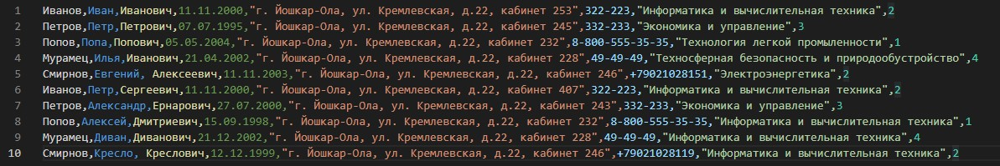

<table style="width: 100%;">
  <tr>
    <td style="text-align: center; border: none;">
    Министерство образования и науки РФ<br>
Государственное бюджетное профессиональное образовательное учреждение Республики Марий Эл<br>
Йошкар-Олинский технологический колледж
</td>
  </tr>
  <tr>
    <td style="text-align: center; border: none; height: 15em;">
    <h2 style="font-size:3em;">Отчет</h2>
      <h3>по лабораторной работе<br><br> по дисциплине "Основы алгоритмизации и программирования"<br><br> Тема:<b> "Основные принципы объектно-ориентированного программирования"<b> </h3></td>
  </tr>
  <tr>
    <br><br><td style="text-align: right; border: none; height: 20em;">
      Разработал:<br/>
      Смирнов Евгений<br>
      Группа: И-21<br>
      Преподаватель:<br>
      Колесников Евгений Иванович
    </td>
  </tr>
  <tr>
    <td style="text-align: center; border: none; height: 5em;">
    г.Йошкар-Ола,<br> 2021</td>
  </tr>
</table>

<div style="page-break-after: always;"></div>

# Цели и задачи:

1: Используя теоретический материал из лекции ["Основные принципы объектно-ориентированного программирования"](https://github.com/kolei/OAP/blob/master/articles/t6_oop1.md) исследовать принцип Объекто-ориентированного программирования.

2: Разработать классы для описанных ниже объектов.

    Student: Фамилия, Имя, Отчество, Дата рождения, Адрес, Телефон, Факультет, Курс. Данные загрузить из CSV-файла. 

3: Вывести в консоль:

    список студентов заданного факультета;
    списки студентов для каждого факультета и курса;
    список студентов, родившихся после заданного года.

4: Результат (исследуемый код и логи) оформить в отдельную ветку в репозитории и отчет о лабораторной работе.

# Краткий материал.

C# является полноценным объектно-ориентированным языком. Это значит, что программу на C# можно представить в виде взаимосвязанных взаимодействующих между собой объектов.
Описанием объекта является класс, а объект представляет экземпляр этого класса. Можно еще провести следующую аналогию. У нас у всех есть некоторое представление о человеке, у которого есть имя, возраст, какие-то другие характеристики. То есть некоторый шаблон - этот шаблон можно назвать классом. Конкретное воплощение этого шаблона может отличаться, например, одни люди имеют одно имя, другие - другое имя. И реально существующий человек (фактически экземпляр данного класса) будет представлять объект этого класса.
# Что же я делал?

1) Разработал класс `Student`

```
public class Student
    {
        public string Name { get; set; }
        public string Familiya { get; set; }
        public string Otchestvo { get; set; }
        public DateTime Birthday { get; set; }
        public string Address { get; set; }
        public string Phone { get; set; }
        public string Facultet { get; set; }
        public int Kurs { get; set; }
        public Student(string name, string familiya, string otchestvo, DateTime birthday, string address, string phone, string facultet, int kurs)
    }
```

2) Создал новый CSV-файл и загрузил его:

```
using (TextFieldParser parser = new TextFieldParser(@"Data.csv"))
```



3) Считывал файл и присваивал соответствующее значение соответствующей переменной

```
    while (!parser.EndOfData)
        {                            
        string[] fields = parser.ReadFields();
        Student tom = new Student();
        tom.Name = fields[1];
        tom.Familiya = fields[0];
        tom.Otchestvo = fields[2];
        .......
        }
```

4) Использовал регулярное выражение для поиска даты:
```

    Regex regex = new Regex(@"(\d\d)\.(\d\d)\.(\d{4})");
    Match matches = regex.Match(fields[3]);
```
5) Использовал LINQ-запросы для поиска и вывода списков, данных в задании

```
    var FacultetList = Students.Select(S => S.Facultet).Distinct();
        foreach(var CurrentFac in FacultetList)
            {

                Console.WriteLine($"\n\nСтуденты факультета: {CurrentFac}");
                var StudentsFac = Students.Where(s => s.Facultet == CurrentFac);
                foreach(var CurrentStudent in StudentsFac)
                {
                    Console.WriteLine($"{CurrentStudent.Familiya} {CurrentStudent.Name} {CurrentStudent.Otchestvo}");
                }
            }
```
# Вывод 

1) Используя теоретический материал из лекции ["Основные принципы объектно-ориентированного программирования"](https://github.com/kolei/OAP/blob/master/articles/t6_oop1.md) исследовал принцип Объекто-ориентированного программирования.

2) Разработал классы для описанных ниже объектов.

    Student: Фамилия, Имя, Отчество, Дата рождения, Адрес, Телефон, Факультет, Курс
    
3)  Данные загрузил из CSV-файла. Вывел:

        список студентов заданного факультета;
        списки студентов для каждого факультета и курса;
        список студентов, родившихся после заданного года.

4)  Результат (исследуемый код и логи) оформил в отдельную ветку в репозитории и отчет о лабораторной работе.